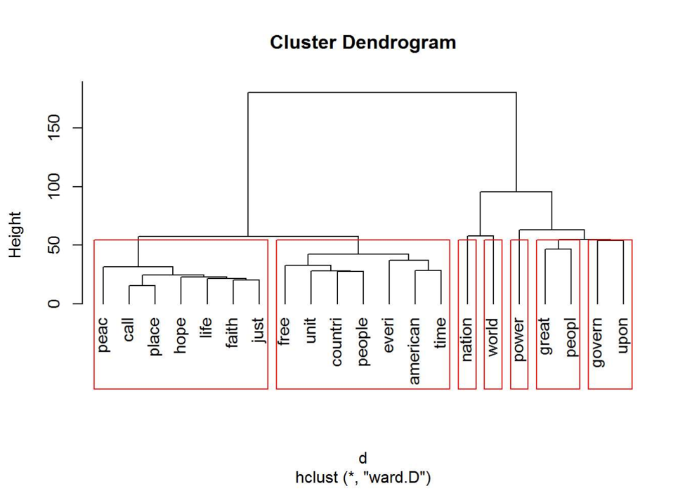
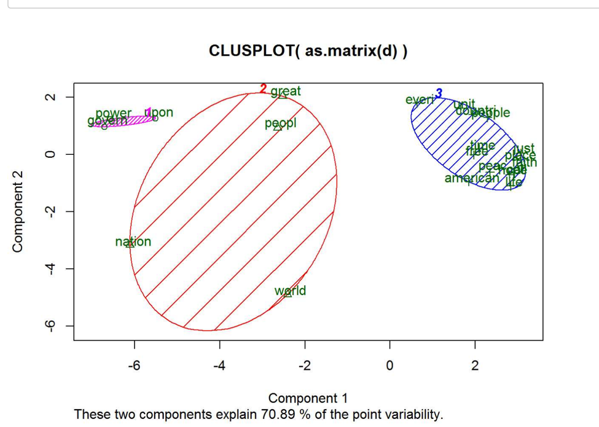
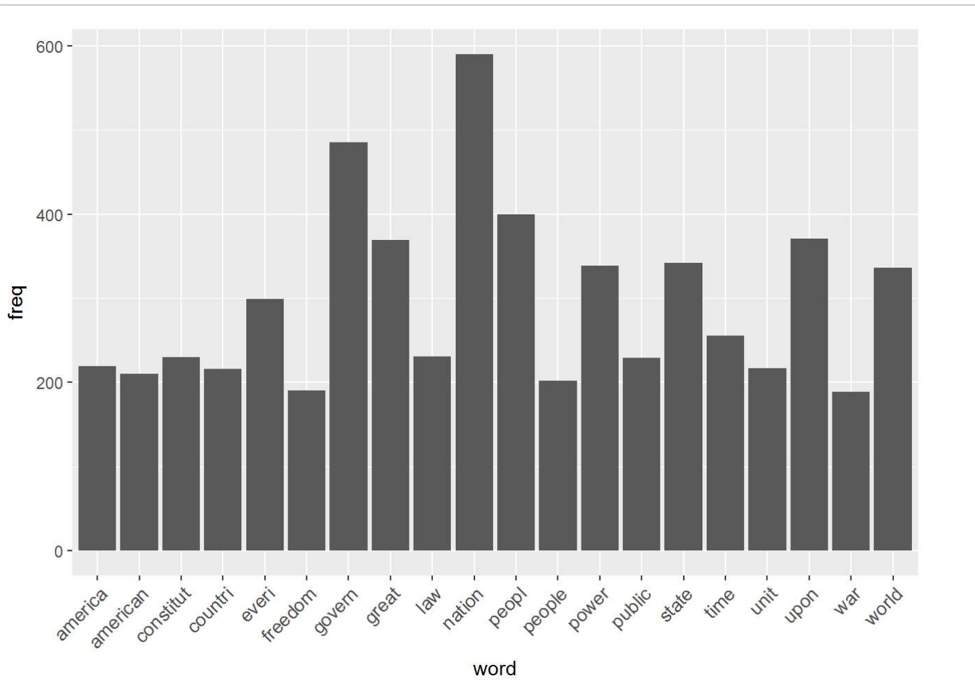
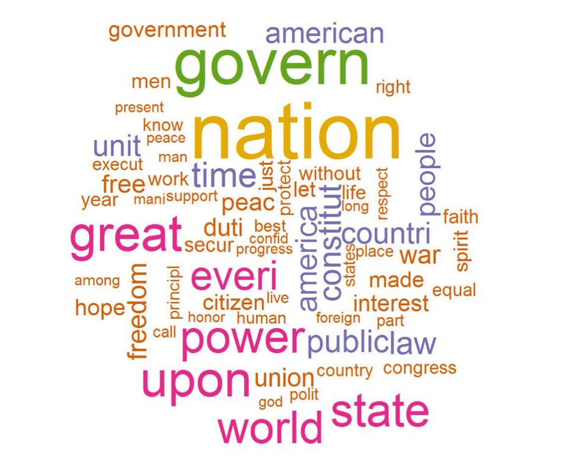
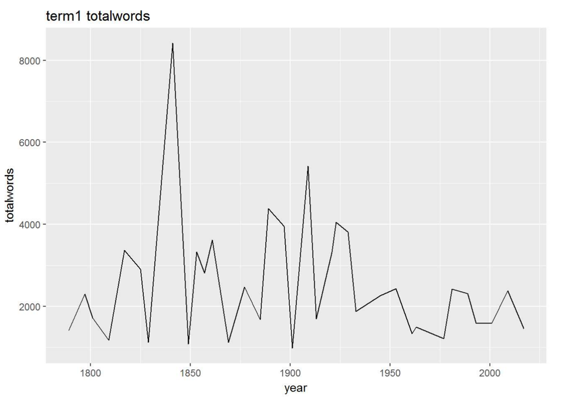
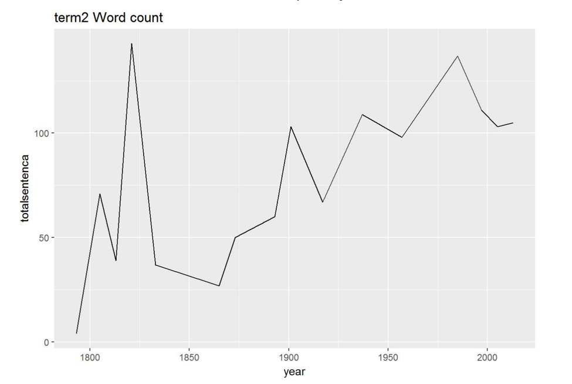
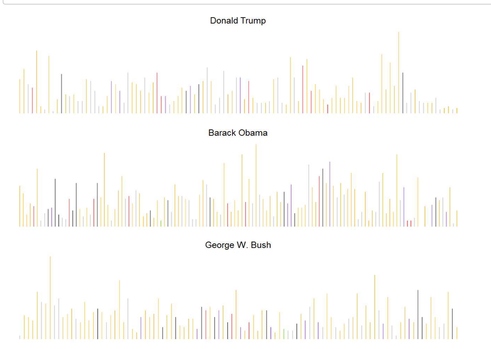
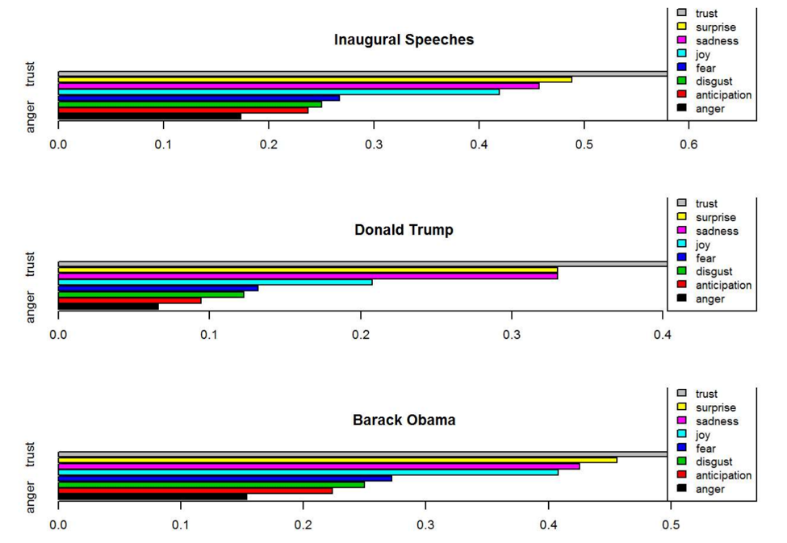
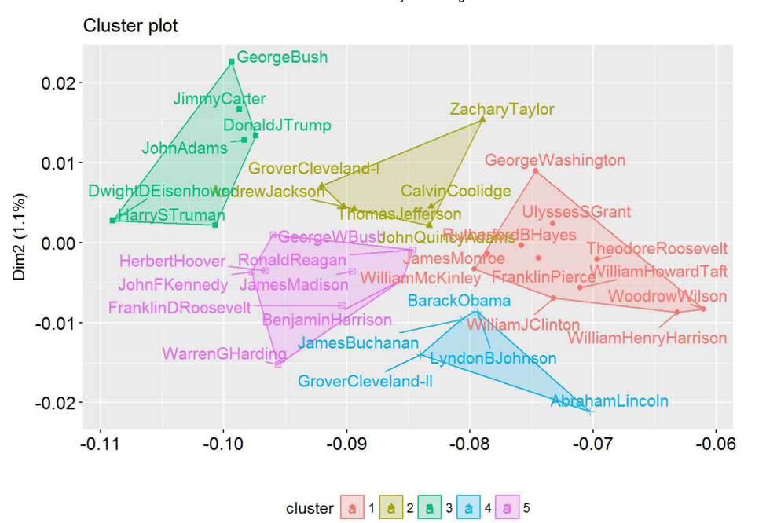

# Text Mining Over Presidents' Speech with NLP

## What did the presidents say at their inauguation?

+ Project title: Text Mining Over Presidents' Speech
+ This project is conducted by: Jason Zishuo Li

+ Project summary: This project analyzed presidents' speech data, performed feature engineering with NLP, built model for the features & visualized the result with R. 

### Steps:

#### details steps could be checked through ADS.Rmd file under "doc" folder

+ Step1: Setting R environment: install & load packages

+ Step2: Data harvest & process: clean data, remove stop words/punc, generate dates matrix

+ Step3: Term analysis\Topic analysis: Generate document term matrix & use LDA to do topic modeling.

+ Step4: Topic Cluster: Ultilized K-means Cluster & Hierarchal Cluster to cluster the term.

+ Step5: Sentiment analysis: Extracted sentiment features from sentence & visualized relationship.

### Some screenshots:

